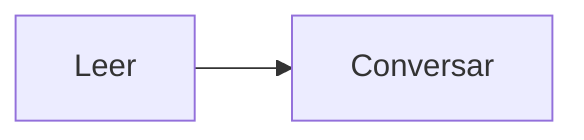

```markmap
# Lectura ficticia
## Preparar
- Elegir un capítulo
## Conversar
- Tres preguntas
## Conservar
- Exportar el resumen
```


```mermaid
graph LR
  A[Leer] --> B[Conversar]
```

```mathjax
2 + 2 = 4
```
